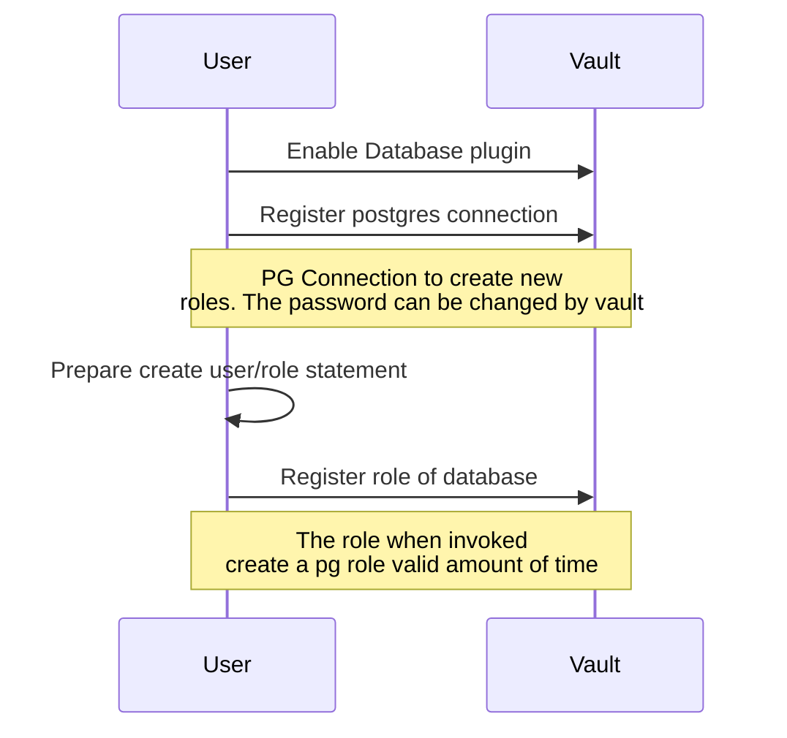
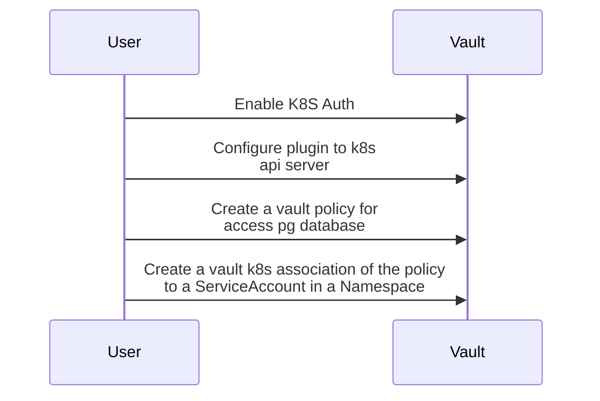
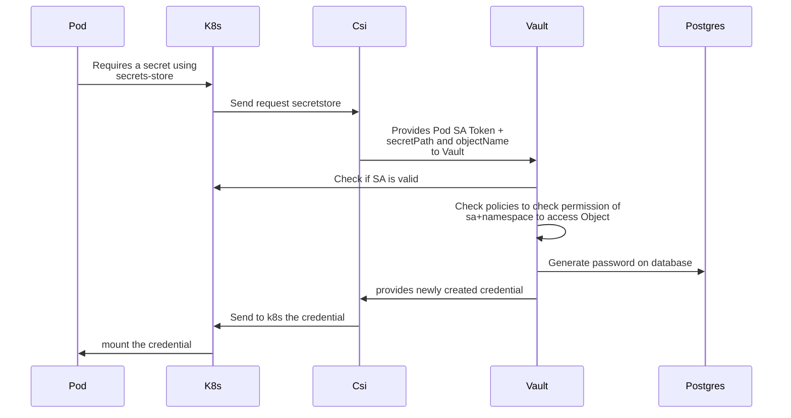
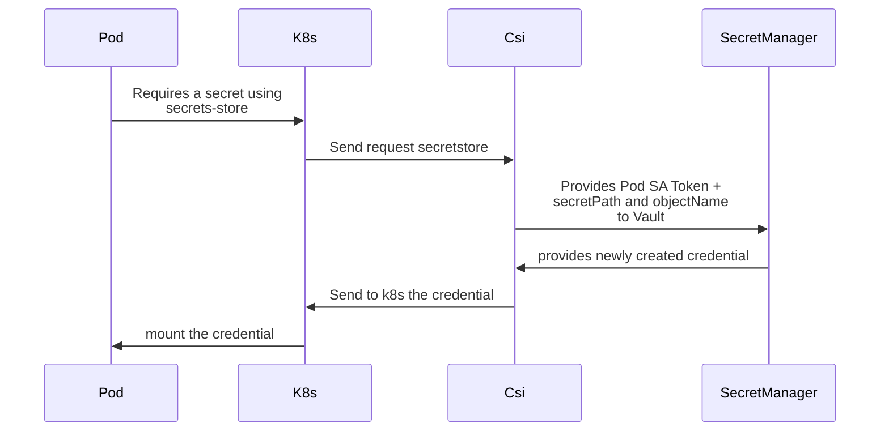

helm Create Postgres
helm create Vault

```mermaid
sequenceDiagram
User->>Vault: Enable Database plugin
User->>Vault: Register postgres connection
Note over User,Vault: PG Connection to create new <br/> roles. The password can be changed by vault
User->>User: Prepare create user/role statement
User->>Vault: Register role of database
Note over User,Vault: The role when invoked <br/>create a pg role valid amount of time
```

```mermaid
sequenceDiagram
User->>Vault: Enable K8S Auth
User->>Vault: Configure plugin to k8s <br/> api server
User->>Vault: Create a vault policy for <br/> access pg database
User->>Vault: Create a vault k8s association of the policy<br/> to a ServiceAccount in a Namespace
```

helm deploy secrets-store-csi-driver

```mermaid
sequenceDiagram
Pod->>K8s: Requires a secret using <br/>secrets-store
K8s->>Csi: Send request secretstore
Csi->>Vault: Provides Pod SA Token + <br/> secretPath and objectName <br/> to Vault
Vault->>K8s: Check if SA is valid
Vault->>Vault: Check policies to check permission of <br/>sa+namespace to access Object
Vault->>Postgres: Generate password on database
Vault->>Csi: provides newly created credential
Csi->>K8s: Send to k8s the credential
K8s->>Pod: mount the credential
```

```mermaid
sequenceDiagram
Pod->>K8s: Requires a secret using <br/>secrets-store
K8s->>Csi: Send request secretstore
Csi->>SecretManager: Provides Pod SA Token + <br/> secretPath and objectName <br/> to Vault
SecretManager->>Csi: provides newly created credential
Csi->>K8s: Send to k8s the credential
K8s->>Pod: mount the credential
```
